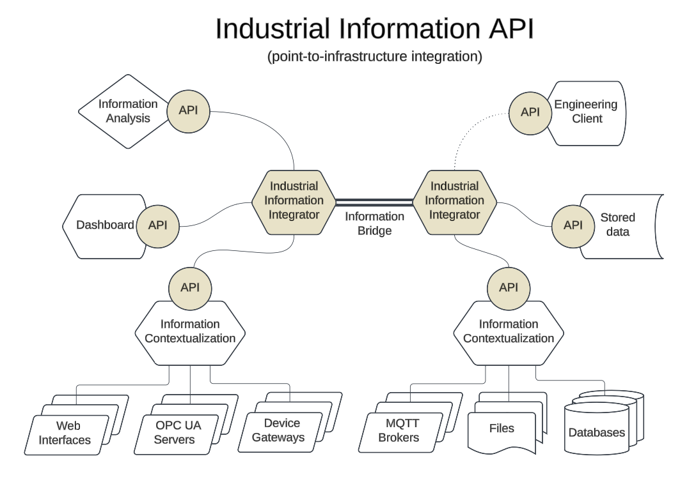
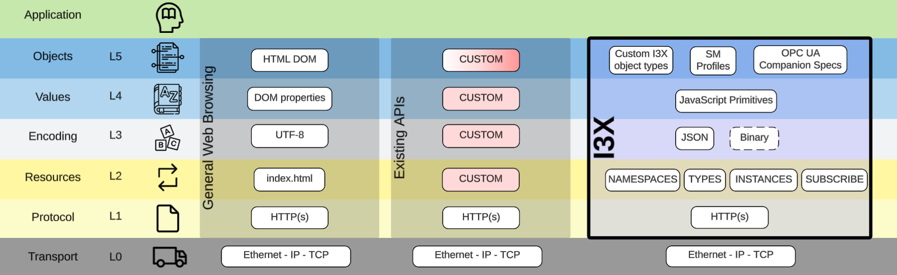

# i3X - Industrial Information Interoperability eXchange

## Status of This Effort

**i3X is in a _Beta_ state.**

> **This branch represents the _current state_ of the effort to establish a 1.0 specification. It contains breaking changes from the Alpha (Community Preview) branch released February 2026!**

The API definition is now largely stable, with only minor changes to response payloads and subscription API signatures expected through Q2 of 2026. If you want to help, please see [Contributing.md](https://github.com/cesmii/i3X/blob/1.0-Beta/Contributing.md).

## What is i3X?

i3X is a Common API for Contextual Manufacturing Information Platforms (i.e. time-series and data analytics applications focused on the manufacturing industry). It aims to provide a common interface for a wide array of back-end data sources with a unified namespace.

<a href="https://i3x.dev/viz"> Click to View Interactive Explainer</a>

## Who is CESMII?

CESMII is the United States' institute for Smart Manufacturing. We are a not-for-profit consortia of manufacturing ecosystem members focused on improving access to clean, contextual information to help manufacturers make better decisions. 

Learn more about CESMII at [cesmii.org](https://www.cesmii.org).

## Where to Learn More

This repo is focused on the development of a specification for the API, including issues, PRs and tasks for the Working Group. This effort is open and collaborative, all are welcome to read and participate -- but this is not the best place to learn the high level details.

For general information about i3X, please visit [https://www.i3x.dev](https://www.i3x.dev).

For implementation information for Client and Server developers, please visit [https://www.i3x.dev/sdk](https://www.i3x.dev/sdk).

## Problem Statement
The manufacturing information ecosystem benefits from the contributions of many players, over multiple decades of technology evolution. While this diversity creates a lot of platform choice for manufacturers, it has the opposite effect on the creation of app value. Application developers must choose which platforms to build against, and therefore are forced to develop against proprietary, or open but competing, API implementations with no hope of portability between them. Apps create information value by consuming and producing the data available in a platform, and rendering it in ways that are helpful to end users -- analytics, visualization, notification, machine learning... all of these need contextualized data, and all end up abstracted by an underlying platform (be it an Historian, MES, MOM, EMI, or broker or server).

## Proposed Solution
i3X proposes a [common API](spec/IMPLEMENTATION_GUIDE.md), consisting of a base set of server primitives that a wide array of platforms can implement to commoditize this access to data. Such a common API does not prevent platform vendors from differentiating on their capabilities, but it will encourage a proliferation of portable apps to help spur adoption of such platforms, and enable a vibrant marketplace of apps bringing value to end-users. The analogies in other industries should be obvious: Apple and Android users benefit from common APIs for access to device and platform capabilities exposed to app developers that have led to App Stores full of creative, useful, and enjoyable app experiences. Those platform vendors have benefited, but more importantly, the user has benefited.

## Call to Action
Without a common approach to accessing platform-contextualized data, we run the risk of needing an entirely new library of "drivers" or adapters to communicate with our modern platforms -- in the same way comms protocols proliferated in the 90s. A growing chorus of end-users, solution providers and vendors, has unified behind a simple, common API definition that is easy to implement and adopt.

With a stable 1.0 release, platform vendors and application developers, must work together to prevent fragmentation and encourage interoperability. Review the inciting [RFC](RFC%20for%20Contextualized%20Manufacturing%20Information%20API.md), read the [Implementation Guide](spec/IMPLEMENTATION_GUIDE.md), visit the [SDK](https://www.i3x.dev), and [Get Started](https://www.i3x.dev/sdk/quickstart) supporting this open, industry-wide effort.

## Background
This proposal has been created by industry participants with experience developing or using manufacturing information platforms such as those provided by Rockwell Automation, HighByte, ThinkIQ, Inductive Automation, ThingWorx and Siemens, are deep users and often contributors to related technology and standards efforts, and have more than 50 years of combined experience in designing, developing, implementing and using manufacturing information software.

## Trying it Out
A public endpoint for the in-progress Demo implementation is available at [https://api.i3x.dev/v1/](https://api.i3x.dev/v1/) with a Swagger page at [https://api.i3x.dev/v1/docs](https://api.i3x.dev/v1/docs).

If you prefer a GUI, [ACE Technologies](https://www.acetechnologies.net) has provided a cross-platform [i3X Explorer](https://www.acetechnologies.net/i3x) client you can use to explore both the i3X functions and the Demo namespace.

The Demo data includes an exploration of the complex relationships supported by i3X. [Review the demo readme](demo/README.md) for an explanation of how these relationships work. 

## API Usage
The block diagram below shows where the i3X API is most applicable, namely within the realm of software applications running on top of operating systems on PCs or servers. Information being accessed through the API are assumed to have already been processed by contexualization functions to make it ready for consumption by other applications.

## API tech stack within the Data Access Model
The image below shows the tech stack for a general Web Browser compared to the i3X API, from the perspective of the Data Access Model.

